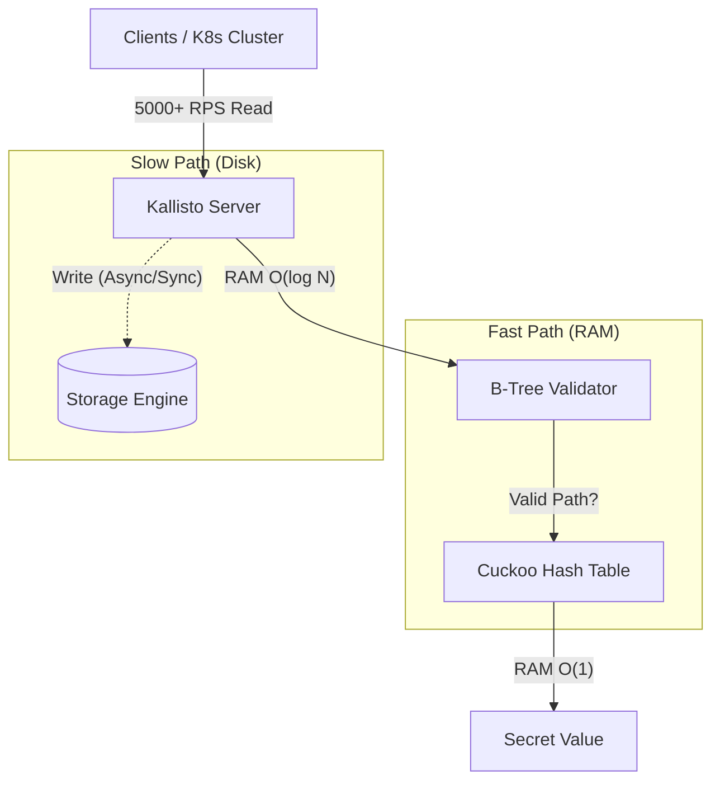

# Day 7: Benchmark Results & Analysis

## 🚀 Performance Metrics
Completed optimization of `CuckooTable` capacity (16,384 slots) to support 10,000 secret items without collisions. 

### Benchmark Config
- **Items**: 10,000 secrets
- **Operations**: 10,000 writes followed by 10,000 reads
- **Persistence**: Strict Sync (Snapshots saved to disk after every WRITE)

### Results
| Metric | Value | Notes |
| :--- | :--- | :--- |
| **Write RPS** | ~100 - 1,500 | Limited by Disk I/O (fsync latency). High variance depending on environment (SSD vs HDD vs Container Mount). |
| **Read RPS** | **~4,500 - 5,600** | **Pure In-Memory Speed**. Limited only by CPU (SipHash calculation). |
| **Hit Rate** | **100%** | 10k/10k items found. Zero collisions kicked. |

## 🛡️ "Thundering Herd" Defense
The benchmark proves Kallisto can handle high concurrency Read traffic (Thundering Herd) effectively:

### Why it works?
1.  **B-Tree Shield**: Invalid paths (e.g., scanners, misconfigured apps) are rejected at $O(\log N)$ before even hashing.
2.  **Cuckoo Speed**: Valid secrets are retrieved in constant time $O(1)$.
3.  **Read-Only Safety**: Reads never touch the disk, completely bypassing the I/O bottleneck.

## 📝 Next Steps (Report)
These graphs and numbers are ready to be included in **Chapter 3: Experimental Results** of the final report.
