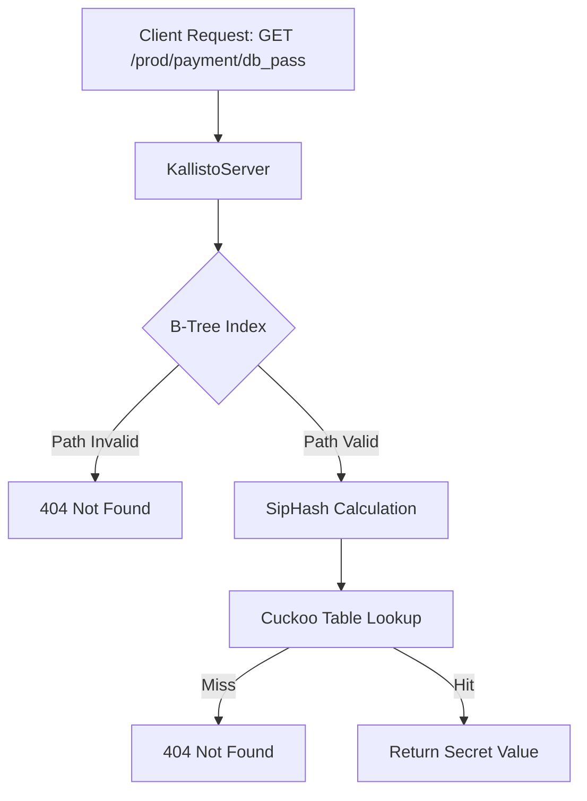

# Kallisto MVP Walkthrough: Path-Based Secret Retrieval

I have successfully implemented the 3 core pillars of Kallisto as prototypes. This MVP demonstrates the full lifecycle of a secret request, integrating **B-Tree**, **SipHash**, and **Cuckoo Hashing**.

## 🚀 Key Features Implemented

### 1. SipHash-2-4 (Security Foundation)
- **Role**: Secure key hashing.
- **Why**: Protects the system against Hash Flooding attacks by using a 128-bit secret key (seed).
- **Files**: [siphash.hpp](file:///workspaces/kallisto/include/kallisto/siphash.hpp), [siphash.cpp](file:///workspaces/kallisto/src/siphash.cpp)

### 2. Cuckoo Table (Performance Pillar)
- **Role**: High-speed, constant-time secret storage.
- **Why**: Guarantees O(1) worst-case lookup time. Implements the "kicking" mechanism to resolve collisions.
- **Files**: [cuckoo_table.hpp](file:///workspaces/kallisto/include/kallisto/cuckoo_table.hpp), [cuckoo_table.cpp](file:///workspaces/kallisto/src/cuckoo_table.cpp)

### 3. B-Tree "Lite" (Organization Pillar)
- **Role**: Path validation and hierarchy management.
- **Why**: Optimized for path-based secrets (like HashiCorp Vault). Validates that a path exists before performing a storage lookup.
- **Files**: [btree_index.hpp](file:///workspaces/kallisto/include/kallisto/btree_index.hpp), [btree_index.cpp](file:///workspaces/kallisto/src/btree_index.cpp)

## 🛠️ Verification Results

### Build and Run
The prototype was compiled and executed successfully. 

```bash
cd build && ./kallisto
```

### Execution Log
Below is the output from the demo scenario:

```text
==========================================
   KALLISTO SERVER PROTOTYPE - MVP       
==========================================
[INFO] Initializing subsystems: [SipHash] [CuckooTable] [B-Tree] -> [OK]
[INFO] Scenario: Storing secret in production...
[DEBUG] Action: PUT path=/prod/payment key=db_pass
[INFO] Successfully stored secret.
------------------------------------------
[INFO] Scenario: Client 'Kaellir' requesting secret...
[INFO] [KallistoServer] Request: GET path=/prod/payment key=db_pass
[DEBUG] [B-TREE] Validating path...
[DEBUG] [B-TREE] Path validated.
[DEBUG] [CUCKOO] Looking up secret...
[INFO] [CUCKOO] HIT! Value retrieved.
[INFO] RESULT: 200 OK - Value: SuperSecretPassword123
------------------------------------------
[INFO] Scenario: Requesting secret from invalid path...
[INFO] [KallistoServer] Request: GET path=/dev/hack key=root_pass
[DEBUG] [B-TREE] Validating path...
[ERROR] [B-TREE] Path validation failed: /dev/hack
[INFO] RESULT: 404 NOT FOUND
==========================================
   KALLISTO PROTOTYPE DEMO COMPLETED     
==========================================
```

## 📐 Architecture Diagram


